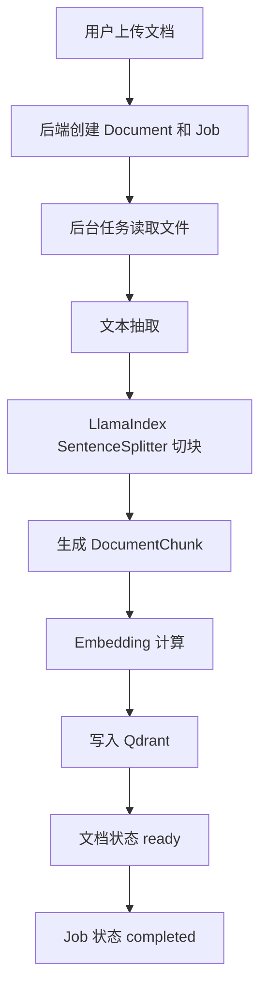
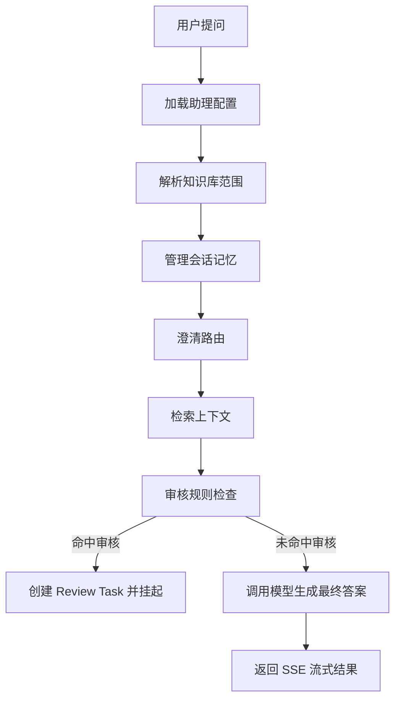
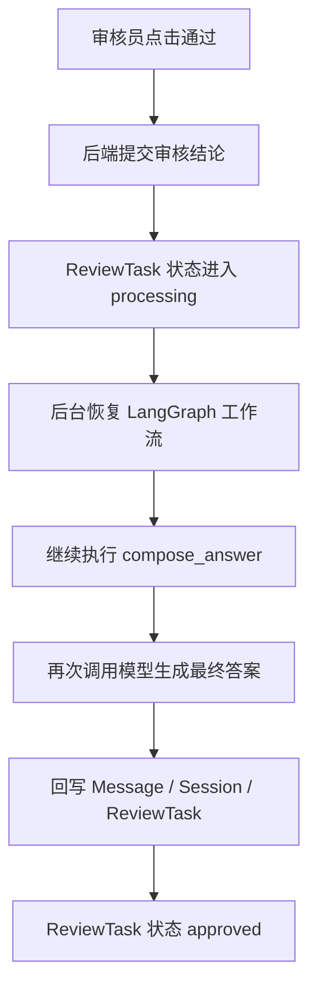
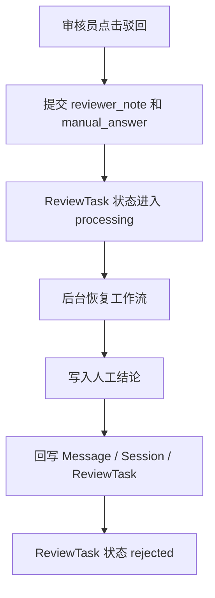

# 企业内部知识库上传式 RAG 系统：面试准备

这份文档用于把项目内容整理成更适合写简历、做项目介绍和准备技术面试的版本，重点包含：

- 技术栈拆解
- 核心流程图
- 面试题与参考回答方向

## 1. 项目一句话介绍

这是一个面向企业内部知识管理场景的上传式 RAG 系统，支持本地文档上传入库、多知识库检索、引用式问答、LangGraph 澄清与人工审核工作流、任务中心与审计日志，目标是从课程 demo 收敛成可内部试点的工程化系统。

简历上可以写成：

> 负责设计并实现企业内部知识库上传式 RAG 系统，基于 FastAPI + Vue 3 + LangGraph + LlamaIndex + Qdrant，完成文档入库、检索增强问答、人工审核工作流、任务中心与审计日志等核心能力，支持多知识库范围问答与流式响应。

如果希望突出工程化和评测能力，也可以写成：

> 负责设计并实现企业内部知识库上传式 RAG 系统，基于 FastAPI + Vue 3 + LangGraph + LlamaIndex + Qdrant，完成文档入库、检索增强问答、人工审核工作流、任务中心与审计日志，并接入 Langfuse 观测、离线评测与 Prompt Management，支持多知识库范围问答、流式响应与回答质量回溯。

## 2. 技术栈

### 2.1 前端

- `Vue 3`
- `TypeScript`
- `Vite`
- `Element Plus`
- `Pinia`

前端职责：

- 登录、助理管理、知识库管理、文档上传
- 会话列表与聊天问答
- 审核台、任务中心、系统总览
- SSE 流式接收回答与状态更新

### 2.2 后端

- `FastAPI`
- `SQLAlchemy`
- `Pydantic Settings`
- `Uvicorn`

后端职责：

- REST API 与鉴权
- 助理、知识库、文档、会话、审核、任务等核心业务
- 文档入库任务编排
- 审核状态流转与工作流恢复

### 2.3 RAG 与工作流

- `LangGraph`
- `LlamaIndex`
- `Qdrant`
- `LangChain Core`

对应职责：

- `LlamaIndex`：文档切块、Qdrant Vector Store 接入
- `Qdrant`：向量检索与 metadata filter
- `LangGraph`：澄清、检索、审核挂起、审核恢复、最终回答生成
- `LangChain Core`：消息结构与 Prompt 组织

### 2.4 数据与部署

- 开发库：`SQLite`
- 生产推荐：`PostgreSQL`
- 迁移：`Alembic`
- 容器化：`Docker`、`Docker Compose`

### 2.5 文档解析

- `pypdf`
- `python-docx`
- `antiword`

## 3. 系统流程图

### 3.1 文档上传入库流程

对应代码入口：

- 路由入口：`server/app/api/routes/documents.py` 的 `upload_document`
- 服务入口：`server/app/services/document_ingestion.py` 的 `create_upload_task`
- 后台处理主函数：`server/app/services/document_ingestion.py` 的 `process_document_ingestion_job`
- 文本抽取：`server/app/services/document_ingestion.py` 的 `_extract_text`
- LlamaIndex 切块：`server/app/integrations/llamaindex_ingestion.py` 的 `run_document_ingestion_pipeline`
- 向量写入：`server/app/integrations/qdrant_store.py` 的 `upsert_chunks`

面试时可以这样讲：

- 上传接口只负责落文件、创建 `Document` 和 `Job`，真正耗时的解析和入库放到后台任务里做
- 后台任务先抽文本，再用 `LlamaIndex SentenceSplitter` 切块，生成 `DocumentChunk`
- 然后统一做 embedding 并写入 `Qdrant`，最后把文档状态改成 `ready`，任务状态改成 `completed`

### 3.2 聊天问答主流程

对应代码入口：

- SSE 路由入口：`server/app/api/routes/chat.py` 的 `stream_session_chat`
- 会话服务入口：`server/app/services/chat_rag.py` 的 `SessionChatService.prepare_stream_context`
- 工作流调用：`server/app/services/chat_rag.py` 的 `_invoke_workflow`
- 工作流定义：`server/app/workflows/chat_graph.py` 的 `build_chat_workflow`
- 检索节点：`server/app/workflows/chat_graph_execution.py` 的 `_retrieve_context`
- 审核节点：`server/app/workflows/chat_graph_execution.py` 的 `_review_gate` 和 `_review_hold`
- 生成节点：`server/app/workflows/chat_graph_execution.py` 的 `_compose_answer`

面试时可以这样讲：

- 聊天接口是 SSE，不是一次性返回，先准备上下文，再按 chunk 往前端推送答案
- 进入 LangGraph 之后，先加载助理配置、解析知识库范围、整理会话记忆，再走澄清路由
- 如果问题可直接回答，就做检索、审核判断和最终生成；如果命中审核规则，就在 `review_hold` 节点挂起

### 3.3 审核通过恢复流程

对应代码入口：

- 审核通过接口：`server/app/api/routes/reviews.py` 的 `approve_review_task`
- 提交审核结论：`server/app/services/review_tasks.py` 的 `submit_approve`
- 后台恢复入口：`server/app/services/review_tasks.py` 的 `process_submitted_review`
- 审核恢复执行：`server/app/services/review_tasks.py` 的 `approve`
- LangGraph resume：`server/app/services/review_tasks.py` 的 `_resume_workflow`
- 恢复后的生成节点：`server/app/workflows/chat_graph_execution.py` 的 `_compose_answer`

面试时可以这样讲：

- 审核员点击通过后，请求线程只负责把 `ReviewTask` 状态推进到 `processing`
- 后台任务再去恢复同一个 LangGraph thread，而不是新开一次问答
- 恢复后从 `review_hold` 继续往下走，进入 `compose_answer`，再次调用模型生成最终答案
- 最后把答案回写到原来的 `Message`，并同步更新 `Session` 和 `ReviewTask`

### 3.4 审核驳回流程

对应代码入口：

- 审核驳回接口：`server/app/api/routes/reviews.py` 的 `reject_review_task`
- 提交驳回结论：`server/app/services/review_tasks.py` 的 `submit_reject`
- 后台恢复入口：`server/app/services/review_tasks.py` 的 `process_submitted_review`
- 驳回执行：`server/app/services/review_tasks.py` 的 `reject`
- LangGraph resume：`server/app/services/review_tasks.py` 的 `_resume_workflow`
- 人工结论写入：`server/app/workflows/chat_graph_execution.py` 的 `_review_hold`

面试时可以这样讲：

- 驳回时要求审核员提交 `reviewer_note` 和 `manual_answer`
- 工作流恢复后不会再走自动生成，而是在 `review_hold` 节点直接把人工结论写成最终答案
- 然后回写原消息、更新会话状态，并把 `ReviewTask` 标记为 `rejected`

## 4. 面试时建议强调的亮点

### 4.1 工程化而不是纯 demo

- 不只是“调一次模型”
- 有文档入库、任务状态、失败重试、审计日志、审核台、系统总览
- 有会话态和工作流恢复，而不是一次性无状态问答

### 4.2 RAG 不是简单向量检索

- 支持多知识库范围选择
- dense retrieval 后做 lexical rerank
- 回答必须带引用片段
- 没命中时有兜底回答

### 4.3 工作流比单 Agent 更可控

- 用 LangGraph 拆成澄清、检索、审核、生成几个节点
- 审核可中断、可恢复
- 审核恢复后仍然能回到原上下文继续完成回答

### 4.4 解决过真实工程问题

- Python 版本兼容问题
- 本地 Qdrant / SQLite 跨线程问题
- `.env` 中 embedding key 解析问题
- 审核通过接口同步阻塞导致超时，改成后台恢复模式

### 4.5 观测与评测不是后补的

- 接入 Langfuse，把 chat turn、workflow、retrieval、rerank、generation 串成一条可追踪链路
- 记录 usage / cost / human review score，便于定位是检索问题、审核问题还是生成问题
- 建了 3 组小型离线 Dataset，支持 `answer_relevance`、`groundedness`、`citation_quality`
- 回答生成 prompt 已接入 Langfuse Prompt Management，可按 `production` label 做版本切换和回滚

## 5. 面试题

以下问题按“项目介绍 -> 架构 -> RAG -> 工作流 -> 工程问题”顺序准备。

### 5.1 项目介绍类

#### Q1：这个项目解决的核心问题是什么？

参考回答：

- 面向企业内部知识问答场景，把分散文档变成可检索、可引用、可审核的问答系统
- 重点不是做通用聊天，而是让回答尽量有知识依据、能回溯、能治理

#### Q2：为什么要做上传式 RAG，而不是直接接外部 connector？

参考回答：

- 一期范围先聚焦本地文档上传，降低系统复杂度
- 先把文档解析、入库、检索、回答、审核、观测这些核心闭环跑通
- 外部 connector 涉及同步、增量更新、权限映射、去重治理，复杂度更高

### 5.2 架构设计类

#### Q3：整个系统是怎么分层的？

参考回答：

- 前端负责配置、上传、聊天、审核和任务可视化
- FastAPI 提供 API 和业务编排
- SQLAlchemy 管理业务数据
- LlamaIndex 做切块与向量库接线
- Qdrant 存储向量
- LangGraph 承担多步工作流和可恢复状态管理

#### Q4：为什么要引入 LangGraph，而不是直接在一个 service 里 if/else？

参考回答：

- 问答链路已经不是单步调用，包含澄清、检索、审核挂起、审核恢复
- LangGraph 更适合表达状态机、节点切换和中断恢复
- 它让“审核通过后从哪里继续执行”这类问题更清晰

### 5.3 RAG 设计类

#### Q5：你的 RAG 流程具体是什么？

参考回答：

1. 上传文档并抽取文本
2. 用 LlamaIndex 分块
3. 计算 embedding，写入 Qdrant
4. 查询时按知识库范围检索
5. dense 召回后做 lexical rerank
6. 用引用片段构造 Prompt
7. 输出带引用的最终答案

#### Q6：为什么还要做 lexical rerank？

参考回答：

- 纯向量召回有时语义相关但关键词不精确
- 企业制度类文档经常有专有词、固定话术、流程名
- lexical 分数可以补充词面匹配信号，降低“语义接近但不够准”的结果排到前面

#### Q7：为什么要按知识库范围过滤？

参考回答：

- 企业场景里不同知识库的用途和边界不同
- 限定知识库范围能降低误召回
- 也为后续 ACL 预过滤打基础

### 5.4 审核工作流类

#### Q8：审核机制是怎么触发的？

参考回答：

- 当前项目有一套规则引擎
- 法律、隐私、医疗、投资类问题命中规则后，不直接自动回答
- 系统先创建 review task，给用户返回“需要人工复核”的占位结果

#### Q9：审核通过之后为什么不是直接返回，而要恢复工作流？

参考回答：

- 因为审核前工作流已经走到 review_hold 节点并中断
- 审核通过后，需要恢复同一个 workflow thread，继续执行后续 compose_answer
- 这样才能保留原来的上下文、检索结果和会话状态

#### Q10：你怎么解决审核通过接口超时的问题？

参考回答：

- 原来 `/approve` 同步恢复 LangGraph，并再次调用模型生成最终答案，导致请求很慢
- 后来改成两段式：
  - 请求线程先提交审核结论，状态进入 `processing`
  - 后台任务恢复工作流并生成答案
- 前端通过轮询 review task 状态观察最终结果

### 5.5 工程问题类

#### Q11：你遇到过哪些比较典型的坑？

参考回答：

- Python 3.14 与 `llama-index-vector-stores-qdrant` 不兼容
- 本地 Qdrant 底层使用 SQLite，跨线程访问会报错
- embedding key 在 `.env` 里配置了，但原实现没正确解析
- 审核通过接口同步调用模型导致超时

#### Q12：本地 Qdrant 的 warning 是什么含义？

参考回答：

- 本地嵌入式 Qdrant 模式下，payload index 不会像服务端 Qdrant 一样真正生效
- 功能通常还能用，但 metadata filter 的性能优化有限
- 适合开发，不适合更正式的生产场景

#### Q13：如果让你继续升级这个项目，你会先做什么？

参考回答：

- 真正的 hybrid retrieval，不只是 dense + lexical rerank
- ACL 预过滤和知识治理字段
- OCR、文档去重、版本治理
- 回答结构化校验和拒答策略
- 更完善的评测体系和实验平台

### 5.6 Langfuse / 评测 / Prompt Management

#### Q14：为什么在 RAG 项目里接 Langfuse？

参考回答：

- 企业场景里，光有回答结果不够，还要知道问题出在哪一段
- 我把 chat turn、retrieval、rerank、generation 串成 trace，方便定位是检索、审核还是模型生成的问题
- 同时记录 usage、cost 和质量分数，便于后续做模型和 prompt 优化

#### Q15：你在 Langfuse 里具体记录了什么？

参考回答：

- 每轮聊天一条 `enterprise-rag.chat_turn`
- `workflow.*`、`rag.retrieval`、`rag.rerank`、`llm.answer_generation`
- LLM usage 和本地静态定价算出来的 cost
- `human_review_decision` 以及离线评测的 `answer_relevance`、`groundedness`、`citation_quality`
- `prompt_name`、`prompt_version`、`prompt_source`

#### Q16：为什么还要做离线评测，不直接看线上聊天结果？

参考回答：

- 线上样本太杂，不适合稳定对比
- 离线 Dataset 能固定问题集，比较 prompt、top_k、模型和检索参数
- 这样调优时可以先在小样本上验证，再决定是否上线

#### Q17：Prompt Management 怎么设计，为什么不直接把 prompt 写死在代码里？

参考回答：

- 代码里仍保留本地 fallback，避免 Langfuse 不可用时影响主链路
- 运行时按 label 取 prompt，比如 `production`，而不是写死版本号
- 改 prompt 不需要重新发版，回滚时只要把 label 指回旧版本
- trace 里会记录 `prompt_version`，能知道某次回答到底用了哪版 prompt

## 6. 简历写法建议

### 6.1 一段版

> 独立实现企业内部知识库上传式 RAG 系统，基于 FastAPI、Vue 3、LangGraph、LlamaIndex、Qdrant 搭建文档入库、引用式问答、人工审核、任务中心与审计日志能力；支持多知识库检索、流式回答、审核挂起与恢复，并解决本地向量库跨线程访问、审核接口超时和配置解析等工程问题。

如果想强调更偏企业级的工程能力，可以改成：

> 独立实现企业内部知识库上传式 RAG 系统，基于 FastAPI、Vue 3、LangGraph、LlamaIndex、Qdrant 搭建文档入库、检索增强问答、人工审核、任务中心与审计日志能力；接入 Langfuse 观测、离线评测与 Prompt Management，支持多知识库检索、流式回答、审核挂起与恢复，并解决本地向量库跨线程访问、审核接口超时和配置解析等工程问题。

### 6.2 三点版

- 设计并实现企业内部知识库上传式 RAG 系统，完成文档上传解析、向量入库、知识库范围检索、引用式问答与 SSE 流式输出。
- 基于 LangGraph 搭建澄清与人工审核工作流，支持 review task 创建、审核挂起、审核恢复、审计日志与任务中心可视化。
- 接入 Langfuse 观测、离线评测与 Prompt Management，支持 trace、usage / cost、人工审核 score、prompt 版本回溯与数据集评测闭环。
- 解决 Python 依赖兼容、本地 Qdrant 跨线程、Embedding 配置解析、审核接口同步阻塞等工程问题，提升系统稳定性与可演示性。

## 7. 面试前最后准备建议

- 先用 3 分钟讲清项目目标、核心链路和技术栈
- 再用 5 分钟讲一个重点模块：
  - 文档入库链路
  - 审核工作流
  - 检索与 rerank
- 最后准备 2 到 3 个你真实解决过的问题，重点说“现象 - 根因 - 修复”
